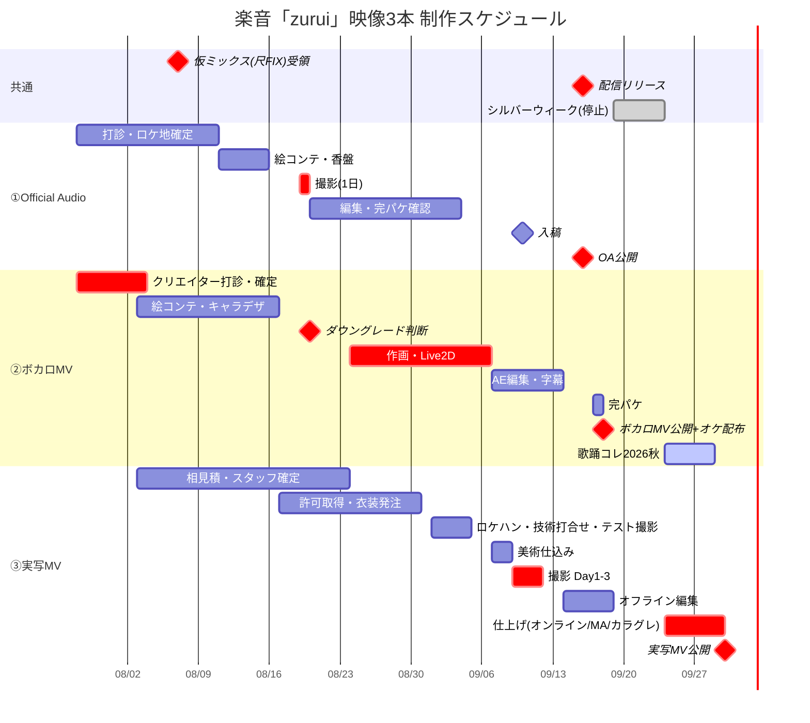

# 全体スケジュール — 3本並走

起点 2026/7/27(月) ／ 総額 640万円

---

## 0. カレンダー確認

2026年9月のシルバーウィークは **9/19(土)〜9/23(水)の5連休**です（9/21 敬老の日／9/22 国民の休日／9/23 秋分の日）。いただいた前提と一致します。

| 日付 | 曜日 | |
|---|---|---|
| 9/16 | **水** | 配信リリース＋OA公開／SoundOnプロモ開始（〜9/30）／USEN開始（〜10/16） |
| 9/18 | **金** | ボカロMV公開 |
| 9/19〜9/23 | 土日月火水 | **シルバーウィーク・全稼働停止** |
| 9/24 | 木 | 稼働再開／**歌踊コレ2026秋 開幕** |
| 9/30 | **水** | 実写MV公開 |
| 10/16 | 金 | USEN終了 |

**持ち時間: OA・ボカロMVまで51日、実写MVまで65日。**

---

## 1. 🚨 クリティカルパスは「ボカロMV」です

3本のうち、**唯一スケジュールが赤信号なのはボカロMV**です。実写MVでも、OAでもありません。

| 本数 | 必要工期 | 使える期間 | 判定 |
|---|---|---|---|
| ① OA（25万） | 撮影1日＋編集2〜3週 | 7週間 | ✅ 余裕あり |
| ② **ボカロMV（100万）** | **アニメ標準工期 2〜3ヶ月** | **7.4週間** | 🚨 **標準工期の下限割れ** |
| ③ 実写MV（500万） | 準備6週＋撮影3日＋ポスト9営業日 | 9週間 | ⚠️ 編集がタイト（SWで5日消滅） |

### ボカロMVのクリティカルパス

```
クリエイター確定    絵コンテ   キャラデザFIX      作画          AE編集      完パケ
   8/3(月) ────→ 8/10 ───→ 8/17 ─────→ 8/24-9/7 ──→ 9/7-9/14 ─→ 9/17
      ▲                                     ▲
      │                                     │
  今週中に打診                     8/20 ダウングレード判断期限
  ここが1日ずれると全部ずれる        （リリックMV版への切替）
      ▲
      └── 仮ミックス（尺FIX）8/7 ← 3本すべての前提
```

> **8/3(月)を過ぎたら、リリックMV＋部分作画版への切り替えを即断してください。**

---

## 2. 週次マスタースケジュール

### 凡例
🎬 = 撮影／📐 = 準備・打合せ／✂️ = 編集・仕上げ／📢 = 公開・宣伝／🚨 = 期限

| 週 | ① Official Audio（25万） | ② ボカロMV（100万） | ③ 実写MV（500万） |
|---|---|---|---|
| **W1**<br>7/28–7/31 | 📐 リッキーさんへ**施設照会**（MVと同一施設か）<br>📐 ロケ地3件見積<br>📐 **EXPG／大学サークル6件へ一斉打診** | 🚨 **クリエイター第1優先5名へ同時打診**<br>📐 会社確認：ピアプロ・原盤権・Content ID | 📐 **500万は税込／税抜かを確定**<br>📐 久保田さんへ替え1着の可否照会<br>📐 楽音の9/9–11 スケジュール確保 |
| | 🚨 **共通：楽曲の仮ミックス（尺FIX）を8/7までに受領する依頼** |||
| **W2**<br>8/3–8/7 | 📐 ロケ地確定・仮押さえ<br>📐 出演者確定・企画書／歌詞／出演承諾書を提示 | 🚨 **8/3 クリエイター確定・契約**<br>📐 BCルームからダンス素材受領 | 📐 廃校ロケ地 相見積3件開始<br>📐 白ホリ 9/11 仮押さえ |
| **W3**<br>8/10–8/14 | 📐 絵コンテ・香盤確定／衣装1ルック確定 | 📐 絵コンテ・カット割り(210秒)<br>📐 キャラデザ着手 | 📐 美術部・照明部の相見積<br>📐 **衣装アップデート発注**（納期2週間） |
| **W4**<br>8/17–8/21 | 🎬 **8/19(水) 撮影本番**（予備日8/20）<br>※ジャケ画・アー写・**MVのロケハン兼衣装テスト**を同時収穫 | 📐 キャラデザFIX／背景美術8〜12枚<br>📐 Live2Dモデル制作 | 📐 ロケ地確定・**注水の書面承諾取得**<br>📐 火災報知器停止手続き |
| | | 🚨 **8/20 ダウングレード判断期限** | |
| **W5**<br>8/24–8/28 | ✂️ 編集（カット→テロップ→簡易カラー）<br>✂️ **出演先の完パケ確認・NGカット差し替え** | ✂️ 本編作画（フル8〜15秒＋リミテッド12〜20カット） | 📐 スタッフ確定<br>📐 **楽音との芝居テスト（半日）** |
| **W6**<br>8/31–9/4 | ✂️ 修正2回まで／縦型切り出し（トリリンガル字幕） | ✂️ 作画継続／Live2Dモーション10種／差分50〜100種 | 📐 **9/1 ロケハン（電源容量を実測）**<br>📐 **9/2 技術打合せ（HEX受領・DMX設計着手）**<br>🎬 **9/4 テスト撮影半日** |
| **W7**<br>9/7–9/11 | ✂️ **9/10 入稿完了・YouTube予約・サムネ入稿** | ✂️ 撮影処理・エフェクト・AE編集<br>✂️ 英語字幕・ローマ字歌詞確定 | 📐 **9/7–8 美術仕込み2日**<br>🎬 **9/9 Day1** 教室・グレー期＋赤期<br>🎬 **9/10 Day2** 水／混色＋S8自然光<br>🎬 **9/11 Day3** 白ホリ＋縦型追撮 |
| **W8**<br>9/14–9/18 | 📢 **9/16(水) 配信リリース＋OA公開**<br>📢 SoundOnプロモ開始／USEN開始 | ✂️ 修正2回まで<br>✂️ **オケ別ミックス・ダンス素材の配布準備**<br>📢 **9/18(金) ボカロMV公開＋オケ配布開始** | ✂️ オフライン編集（デイリー運用）<br>📐 **9/17 社内テストスクリーニング5名** |
| **SW**<br>9/19–9/23 | **全稼働停止** | （外部で歌い手・踊り手が制作中） | **全稼働停止** |
| **W9**<br>9/24–9/29 | 📢 別ver.切り出しの配信運用 | 📢 **9/24–28 歌踊コレ2026秋**（投稿を拾って公式が反応） | ✂️ 9/24 ピックアップ半日・**ABテスト結果でS9ダンス選択**・オフラインFIX<br>✂️ 9/25 オンライン・VFX・MA<br>✂️ **9/28 カラグレ1日（立会い）**<br>✂️ **9/29 マスター書き出し専用日** |
| **W10**<br>9/30– | | 📢 ABテスト勝ち残り3ダンスで追撃 → 大型インフルエンサーコラボ | 📢 **9/30(水) 実写MV公開（21:00プレミア）** |
| **10月** | | | 📢 縦型22本＋別ver.を10/末まで投下（→ [配信カレンダー](03_live-action-mv.md#配信カレンダーバズの波を2回作る)） |

---

## 3. Gantt



---

## 4. ⚠️ 競合・依存関係（見落としやすい点）

### ① 楽音本人の稼働が最も逼迫します

| 日付 | 内容 |
|---|---|
| 8/19(水) | OA撮影（終日） |
| 8月下旬 | 実写MVの芝居テスト（半日） |
| 9/4(金) | 実写MVテスト撮影（半日） |
| **9/9・9/10・9/11** | **実写MV撮影（3日連続・全日）** |
| **9/16(水)** | **リリース当日のSNS対応** ← 撮影の5日後 |
| **9/18(金)** | **ボカロMV公開のSNS対応** |
| 9/24(木) | ピックアップ半日 |

**9/9〜9/11の3日連続撮影の直後に、9/16リリース・9/18ボカロMVのSNS対応が来ます。** マネジメントと**必ず事前に握ってください。**ここが崩れると撮影日を動かすしかなくなり、9/30公開が危険になります。

### ② 実写MVは、ボカロMVの成果物を「公開前に」必要とします

実写MV撮影（9/11）は、ボカロMV公開（9/18）**より1週間前**です。それなのに実写MVのS9は「ボカロMVのキーカラー5色」と「ダンス」を必要とします。

| 必要なもの | 期限 | 誰から |
|---|---|---|
| **キーカラー5色のHEXコード** | **9/2（技術打合せ）** | ボカロMVイラストチーム |
| **候補ダンス3本の映像＋カウント表** | **9/4** | BCルーム経由ダンス担当 |

**→ これが遅れると照明のDMXプログラムが組めず、S9が撮れません。**

### ③ ABテストの結果は、撮影時点では出ていません

「ABテストで勝ち残った3ダンス」の結果が出るのは**SW明け（9/24〜）**。撮影は9/11。

**→ 解決策**: 9/11の白ホリ日に**候補3ダンスすべての引用カット（各2〜3秒）を撮る。**編集は9/24〜29なので、**結果を見てから編集で選べます。**同一セット・同一衣装なので追加コストはほぼゼロ。

### ④ OAとMVは同じロケ地を狙うべきですが、押さえは別に必要です

3本の連続性を最大化するには **OA（8/19）と実写MV（9/9-10）を同一施設**で撮るのが理想です。ただし：
- OA予算では**教室スタジオ（1〜3万円台）**が現実的
- MV予算では**廃校の一棟貸し（15〜22万円）**が必要（注水・大量の照明・改造が必要なため）

**同一施設が難しい場合は「同型（木造 or 昭和期RC造）」で統一**してください。→ **リッキーさんへの照会が最優先。**

### ⑤ 高校ダンス部は9/12まで使えません

| 大会 | 日程 |
|---|---|
| 日本高校ダンス部選手権 全国準決勝 | **8/17〜18** |
| 同 **全国決勝** | **9/6(日)** |
| 全日本高校チームダンス選手権 決勝 | **9/12(土)** |

**OA（8/19撮影）に高校ダンス部を当てるのは不可能です。** 大学ダンスサークル／ダンススクール／芸能・ダンス専門学校（全員成人）に振ってください。→ [OA企画 2章](01_official-audio.md)

### ⑥ ボカコレ2026夏には間に合いません（歌踊コレ2026秋に全振り）

ボカコレ2026夏の投稿集計期間は **8/20(木)19:00〜8/24(月)17:00**。9/16リリースでは**完全に対象外**です。次のボカコレは冬。

**一方、歌踊コレ2026秋（9/24〜28）はシルバーウィーク明けに完璧に噛み合います。** → [ボカロMV企画 6章](02_vocaloid-mv.md)

---

## 5. マイルストーン一覧（これだけは死守）

| 期限 | マイルストーン | 遅延した場合 |
|---|---|---|
| **7/31(金)** | ボカロMVクリエイターへの打診完了 | 8/3の確定が間に合わない |
| **8/3(月)** | 🚨 **ボカロMVクリエイター確定** | **リリックMV版へ即切り替え判断** |
| **8/7(金)** | 🚨 **楽曲の仮ミックス（尺FIX）受領** | 実写MVの構成表が組めない・ボカロMVのカット割りが組めない |
| 8/14(金) | 実写MV：ロケ地・美術部・照明部の相見積完了／衣装発注 | 9月上旬の押さえが取れなくなる |
| **8/19(水)** | **OA撮影** | 出演先の完パケ確認時間がなくなる |
| **8/20(木)** | 🚨 **ボカロMVのダウングレード判断期限** | 9/18に間に合わない |
| 9/2(火) | **ボカロMVのHEX5色を実写MVチームへ受け渡し** | S9が撮れない |
| 9/4(金) | 実写MVテスト撮影／候補ダンス3本の確定 | 衣装・照明の事故が本番当日に発覚する |
| **9/9–9/11** | **実写MV撮影3日** | 9/30公開が不可能に |
| 9/10(木) | **OA入稿完了** | 9/16に間に合わない |
| **9/17(木)** | ボカロMV完パケ／実写MV テストスクリーニング | — |
| **9/18(金)** | 🚨 **ボカロMV公開＋オケ・ダンス素材の配布開始** | 歌踊コレ（9/24〜）の初速を逃す |
| 9/29(火) | 実写MV マスター書き出し（**作業を入れない日**） | — |

---

## 6. 今週（7/28〜7/31）やることリスト

### 全体
- [ ] 🚨 **楽曲の仮ミックス（尺FIX）を8/7までにもらう依頼**（完パケ不要、尺だけ）← 3本すべての前提
- [ ] **「500万円は税込か税抜か」を確定**
- [ ] **楽音のスケジュール確保**（8/19／8月下旬半日／9/4／**9/9-11**／9/24）をマネジメントと握る
- [ ] **ボカロMVの目的を決める**：韓国オーディエンス深堀り（A）／ボカロ圏の新規開拓（B）
- [ ] **チャンネルの外部リンク・概要欄を整備**（現状リンク0本。**コスト0・即効性あり**）

### ① Official Audio
- [ ] **リッキーさんへ施設照会**（実写MVと同一施設にできるか）← 3本の連続性が決まる
- [ ] ロケ地3件に見積依頼（スタジオカーニヴァル／飯田橋でっかいレンタルスペース／昭島市内の廃校）
- [ ] **EXPG STUDIO 企業向けフォームから発注相談** https://expg.jp/tiktok_job_offer/
- [ ] **大学ダンスサークル6件へDM＋公式フォームの両建て打診**
- [ ] 歌詞全文を打診資料に添付できる状態にする
- [ ] Seoul Visualizer との差別化コンセプトを社内合意

### ② ボカロMV
- [ ] 🚨 **クリエイター第1優先5名へ同時打診**（金属8g／じぇねらる／Atena／ABM／梅かっぱ）
- [ ] **BCルーム経由ダンスの素材受領**（映像＋カウント表）＋**振付の二次利用許諾の確認**
- [ ] **会社確認**：オケのピアプロ配布可否／原盤権者／Content ID登録方針／JASRAC支分権「インタラクティブ配信」
- [ ] 重音テトver.の要否を最終確認（→ [README](../README.md#おまけ重音テストの会社的にむずいには抜け道があります)）

### ③ 実写MV
- [ ] **久保田さんへ3点照会**（衣装色HEX／**替え1着の可否・金額・納期**／光沢アクセントの可否）
- [ ] **ボカロMVイラストチームへHEX5色の共有依頼**（期限9/2）
- [ ] **BCルームへ候補ダンス3本の受領時期を確認**（期限9/4）
- [ ] 廃校ロケ地の問合せ開始（**全件が要問合せ・9月上旬の押さえは8月には埋まる**）
- [ ] 白ホリスタジオ 9/11 の空き確認（ワンストップスタジオ東京 STUDIO 3）
